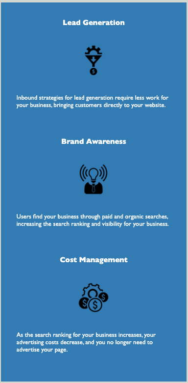

# horiseon-refactor

## DEPLOYED LINK
[horiseon](https://lukenorys.github.io/horiseon-refactor/)

## DESCRIPTION: 
### refactor code for SEO and accessibility

## TASKS:
* scout code
* improve semantic HTML
* follow accessibility standards
* make structure logical and sequential
* consolidate CSS (DRY)

## SCREENSHOTS
### The header contains the nav bar that brings you to thw 3 sections each containing articles.

## SECTION 1
### This first section contains the 'Search Engine Optimization' article.

## SECTION 2
### This first section contains the 'Online Reputation Management' article.

## SECTION 3
### This first section contains the 'Social Media Marketing' article.

## ASIDE
### The aside contains tips
